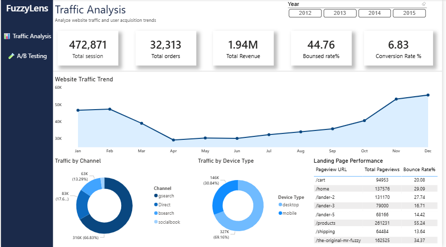
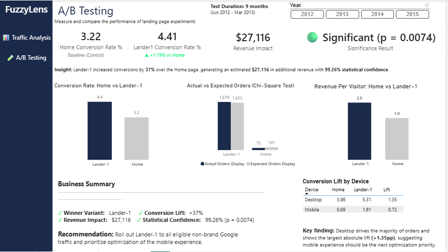

# FuzzyLens | E-Commerce Analytics

End-to-end analytics project on the Maven Fuzzy Factory e-commerce dataset — covering data cleaning, SQL analysis, an A/B test with statistical significance testing, and a two-page Power BI dashboard.

**Tools used:** Python (pandas, scipy) | PostgreSQL | DAX | Power BI

---

## Project Highlights

- Analyzed **472,871 sessions** and **32,313 orders** across 3 years of e-commerce data
- Ran a **chi-square significance test** proving a landing page A/B test result was real, not random (p = 0.0074)
- Quantified the test's impact at an estimated **$27,116 in additional revenue**
- Recreated the entire SQL analysis natively in **DAX** — including session-level filtering with `CALCULATE` + `ALLEXCEPT` and dynamic measure-switching
- Found a deeper, non-obvious insight: the page-level lift was small compared to the **desktop vs. mobile conversion gap**, reframing the actual business recommendation

---

## Project Overview

Maven Fuzzy Factory is an e-commerce business selling plush toys online. This project analyzes three years of website traffic, sales, and an A/B test on the site's landing page to answer three core business questions:

1. Where is traffic coming from, and which sources are worth the ad spend?
2. How many visitors are bouncing immediately, and why?
3. Did switching the landing page from `/home` to `/lander-1` actually improve conversion — and is that improvement statistically real?

---

## Dataset

Maven Fuzzy Factory dataset (Maven Analytics) — 6 relational tables covering orders, order items, refunds, products, website sessions, and website pageviews. ~472,871 sessions and 32,313 orders across March 2012 to March 2015.

---

## Phase 1: Data Cleaning (Python)

- Loaded and validated all 6 tables — confirmed zero duplicates and zero unexpected nulls
- Converted all date fields to proper datetime format
- Verified row counts and date ranges aligned correctly across tables

---

## Phase 2: SQL Analysis (PostgreSQL)

Key queries written (see `/sql` folder):
- Traffic breakdown by source, campaign, and device type
- Bounce rate calculation using session-level pageview counts (CTE + HAVING)
- Landing page A/B test: session and conversion comparison between `/home` and `/lander-1`, filtered to the exact test window and gsearch nonbrand traffic
- Device-level conversion breakdown for both landing pages

**Finding:** gsearch nonbrand drives 67% of all traffic, but socialbook referral traffic bounces at 77.6% versus gsearch's 44.4% — a clear sign of low-quality acquisition spend.

**Finding:** `/lander-1` converted at 4.41% versus `/home`'s 3.22% — a 37% relative lift — but with `/home` only having 2,328 test-period sessions, the gap needed statistical proof, not just comparison.

---

## Phase 3: Statistical Significance Testing (Python)

Ran a chi-square test of independence on the conversion data using `scipy.stats.chi2_contingency`.

**Result:** p-value = 0.0074 (well under the 0.05 threshold) — the conversion lift is statistically significant with 99.26% confidence, not due to chance.

**Action:** Recommend permanently routing all gsearch nonbrand traffic to `/lander-1`.

**Impact:** Estimated **$27,116** in additional revenue generated during the 9-month test window, based on the gap between actual and expected orders.

---

## Phase 4: Power BI Dashboard

Two-page interactive dashboard built with PostgreSQL as a live data source and DAX measures recreating the full SQL logic natively in Power BI (including session-level CALCULATE + ALLEXCEPT filtering and SWITCH-based dynamic measures).

**Page 1 — Traffic Analysis:** Sessions, orders, revenue, bounce rate and conversion KPIs; traffic by channel and device; bounce rate by source; sessions trend with year slicer; top landing pages by pageviews and bounce rate.

**Page 2 — A/B Testing:** Conversion rate comparison, chi-square actual-vs-expected orders, revenue-per-visitor comparison, device-level conversion lift breakdown, and an executive business summary with a clear recommendation.

---

## Key Business Recommendations

1. **Roll out `/lander-1`** to all eligible gsearch nonbrand traffic — statistically proven 37% conversion lift.
2. **Reduce or pause socialbook spend** — 77.6% bounce rate signals poor traffic quality relative to cost.
3. **Prioritize mobile landing page optimization** — both pages convert far better on desktop (3.96% / 5.31%) than mobile (0.89% / 1.61%), and this gap is larger than the page-level A/B lift itself.

---

## Skills Demonstrated

- **Python:** pandas (data cleaning, validation), scipy.stats (chi-square hypothesis testing)
- **SQL (PostgreSQL):** CTEs, window functions, HAVING vs WHERE, multi-table JOINs, LEFT JOIN logic for conversion funnels
- **Statistics:** Hypothesis testing, p-values, statistical significance, expected vs. actual comparison
- **DAX:** CALCULATE with cross-table filtering, ALLEXCEPT, SWITCH + SELECTEDVALUE for dynamic measures, DISTINCTCOUNT
- **Power BI:** Multi-page report design, custom DAX measures replicating SQL logic, Chiclet slicers, professional dashboard UX
- **Business analysis:** Translating statistical results into revenue impact and actionable recommendations

---

## Files in this Repository

- `phase1_cleaning.py` — Python data loading and validation script
- `sql_queries.sql` — All SQL analysis queries
- `FuzzyLens.pbix` — Power BI dashboard file
- `/screenshots` — Dashboard page exports
- `dataset/` — Source CSV files

---

## Dashboard Preview

### Traffic Analysis

### A/B Testing

